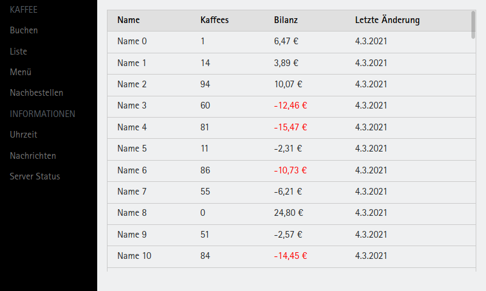

# kaffee-ui

<p align="center">

</p>

## Funktion

Die Oberfläche funktioniert in dem Stil einer _Single-Page-Webanwendung_. Diese muss mit dem [kaffee-server](https://github.com/j0hax/kaffee-server) verknüpft werden.

Nutzer werden mittels `localStorage` in einem stringified Array zwischengespeichert im Fall eines Netzwerkausfalls.

Mit dem STRONGLINK SL040A Kartenleser es möglich Ordnungsnummern auszulesen; nach dem Drücken der <kbd>Enter</kbd> Taste wird der Puffer mit den Nummern der Nutzer verglichen und im Falle von Übereinstimmung ein Kaffe auf dem Nutzer gebucht.

## Screenshots



### Datenbeispiel
```json
[
   {
      "balance":9001,
      "drinkCount":42,
      "hash":"9f86d081884c7d659a2feaa0c55ad015a3bf4f1b2b0b822cd15d6c15b0f00a08",
      "id":1,
      "lastUpdate":1617281972.4809017,
      "name":"Johannes Arnold"
   }
]
```
*Beispiel: Nutzer Johannes Arnold hatte 90,01€ eingezahlt und inzwischen wieder 42 Kaffee getrunken.*

## Konfiguration

Die Seite muss mit einer einfach Datei `config.js` vor Inbetriebnahme konfiguriert werden.

Vor allem wichtig ist ein API-Schlüssel zu erzeugen, wenn der Server eingesetzt wird.

### Beispielkonfiguration
```javascript
const config = {
  apiKey: 'pClZQgSXmHgIt1sHeOpb64iHrLxfc+7D',
  server: 'http://localhost:8080/api',
  drinkPrice: 30
}
```
